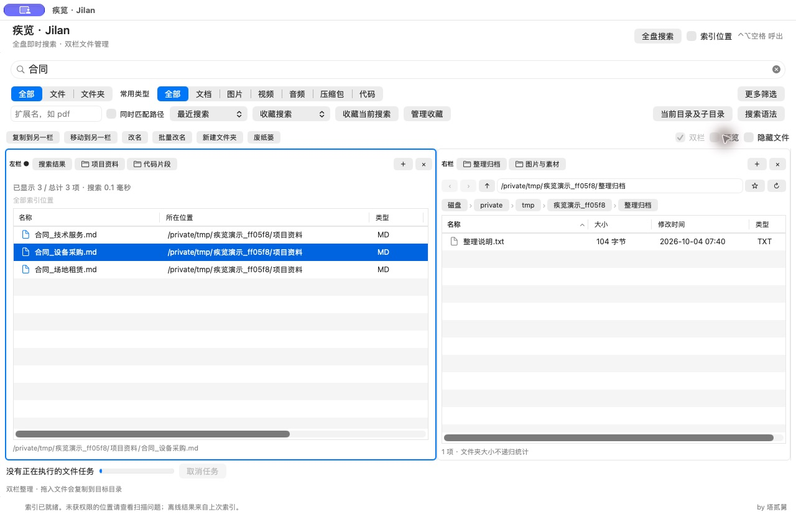
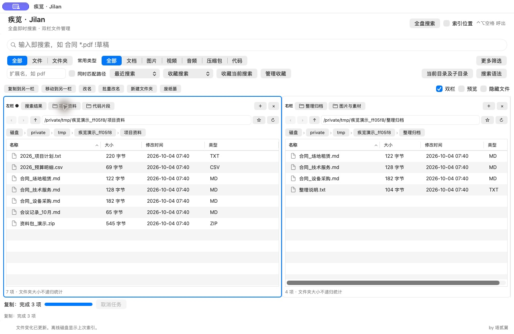
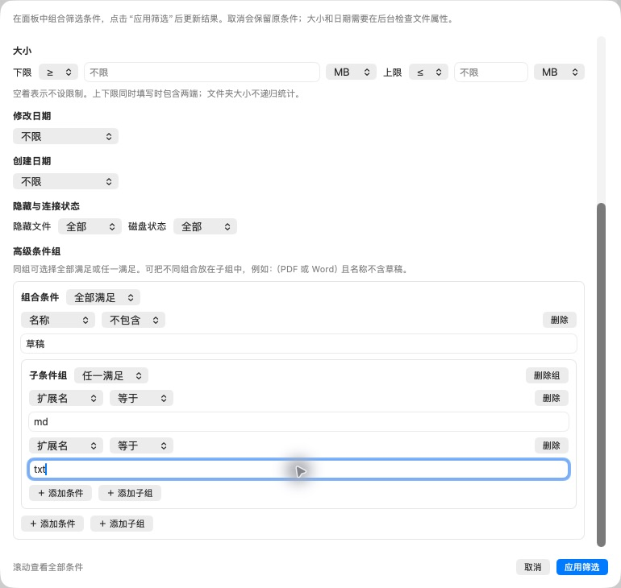

# 疾览 · Jilan

**即时查找，双栏整理。by 塔贰舅。**

疾览是面向 **Apple Silicon Mac / macOS 14+** 的中文文件搜索与管理工具。像 Everything 一样，先建立本地文件名称索引，再随输入快速查找；找到文件后，可在同一窗口预览、复制、移动和整理。

**免费使用，不需要账号、订阅或付费接口。** 如果对你有帮助，欢迎点一个 Star、分享给朋友，或提交使用反馈。自愿赞助渠道如有设置，会由作者在本仓库公布。

[下载与安装](https://github.com/RGB-hengzhi/Jilan/releases/latest) · [使用指南](docs/使用指南.md) · [问题反馈](https://github.com/RGB-hengzhi/Jilan/issues)

## 为什么用疾览

**快速检索 · 组合筛选 · 双栏多标签 · 原生预览**

- **记得一点名称，就能开始找**：本地名称索引配合输入即搜，不必逐层打开文件夹；支持多个关键词、扩展名和通配符。
- **找到之后，直接整理**：左边保留跨目录搜索结果，右边打开目标文件夹，在同一工作区复制、移动、改名。
- **条件越明确，结果越聚焦**：把类型、名称、路径、大小、日期和目录范围组合起来；复杂需求可使用“全部满足 / 任一满足”条件组。
- **多处文件，一起处理**：双栏各自保留目录标签，配合 Quick Look 预览、单项改名和先预览再确认的批量改名，减少来回切换。
- **适合 Mac 的中文工具**：Swift/AppKit 原生界面、系统预览与 Finder 定位；免费使用，搜索索引保存在本机。

## 2.2.2：降低索引和后台任务内存

- 父目录前缀共享存储，减少每个文件重复保存的路径。
- 大小与日期筛选分批检查候选，结果保留按需限制，避免一次构造全量文件对象。
- 扫描去重、文件事件合并与目录 / 属性后台读取增加容量和取消保护。

同一批 **2,220,920 条索引**的独立引擎测试各运行三轮：稳定 `phys_footprint` 从旧版 **963.9–965.3 MB** 降到 **390.0–446.2 MB**；按最保守对照减少 **53.7%**。这是十进制 MB 的引擎测试结果，**不是 GUI 全盘扫描或文件整理过程的内存峰值**。详见 [内存优化说明](docs/内存优化说明.md)。

## 实际界面

以下为 **2.2.1 实际运行截图**，使用专门创建的演示文件展示功能，不包含用户私有文件。截图中的查询耗时仅对应这组演示资料，不作为全盘性能基准。

### 输入即搜：从文件名称快速定位



在已建立的本地索引内搜索文件和文件夹名称，结果随输入更新。选中后可预览、打开或定位到 Finder，无需按回车启动查询。

### 搜索与整理衔接：双栏、多标签、预览



搜索结果与目标目录放在同一窗口。可多选文件并复制或移动到另一栏，也可浏览多个目录标签，使用预览和改名工具整理文件。

### 组合筛选：把条件说清楚



除名称与扩展名外，还可以组合大小、修改 / 创建日期、包含 / 排除目录、隐藏状态、磁盘连接状态及嵌套条件组。大小和日期需检查实际文件属性，其查询耗时与纯名称检索不同。

## Everything 的即搜思路，XYplorer 的整理工作流

疾览把“先找到，再整理”放进一个原生 Mac 工作区。参照的是两款工具的使用方式，具体功能由疾览实现：

| 工作流参照 | 疾览当前提供的功能 |
| --- | --- |
| [Everything：即时文件名称检索](https://www.voidtools.com/support/everything/) | 本地名称索引、输入即搜、文件与文件夹检索、关键词与扩展名筛选。 |
| [XYplorer：双栏、多标签、预览与批量改名](https://www.xyplorer.com/features.php) | 双栏目录标签、搜索结果直接复制 / 移动到目标目录、系统预览、单项与批量改名。 |
| macOS 原生操作习惯 | 中文 AppKit 界面、Quick Look、Finder 定位及 Mac 快捷键。 |

疾览是独立项目，与 Everything、XYplorer 没有隶属、授权或合作关系；未使用这两款产品的代码、图标或 Logo。名称检索核心实际复用的是下文列明的 GPL 开源项目 Cling。上表介绍疾览已实现的部分功能，不能据此理解为移植了两款工具的全部能力。

## 下载与安装

安装包名为 `Jilan-2.2.2-macOS-arm64.dmg`，打开后把「疾览」拖到「Applications」文件夹，再从「应用程序」启动。当前版本 **2.2.2 / 构建 9**，仅支持 Apple Silicon，不提供 Intel 版本。分享时请同时提供同目录的 `Jilan-2.2.2-source.zip` 相应源码；公开版本在 [Releases 下载页面](https://github.com/RGB-hengzhi/Jilan/releases/latest) 以同一版本安装包与源码配对提供。

应用使用本地 ad-hoc 签名，**没有 Developer ID 签名，也未经过 Apple 公证**。首次打开可能被 macOS 阻止；确认下载来源和 SHA-256 校验值后，可按 [Apple 官方说明](https://support.apple.com/zh-cn/102445)，在「系统设置 → 隐私与安全性」选择「仍要打开」。详细步骤见 [安装说明](docs/安装说明.md)。

## 能做什么

- **输入即搜索**：查找文件和文件夹名称，多关键词、扩展名、通配符与组合条件，无需按回车开始查找。
- **搜索与整理衔接**：左栏固定「搜索结果」及目录标签，右栏保留目标目录；从多个目录搜到的文件可直接整理到另一栏。
- **双栏多标签**：目录导航、收藏、会话恢复、复制/移动、单项和批量改名、新建文件夹、废纸篓。
- **更细的筛选**：类型、名称、路径、大小、修改/创建日期、包含/排除目录、隐藏状态、磁盘在线状态，以及嵌套条件组。
- **本地索引**：内置硬盘、已连接本地外置磁盘和自选文件夹；系统文件变化通知更新索引，启动及磁盘重连时校准，离线磁盘保留名称缓存。
- **原生体验**：Swift/AppKit 中文界面、系统 Quick Look 预览、Finder 定位和全局快捷键。

它搜索文件名称和路径，不提供文件内容全文搜索。首次建索引需要遍历目录；后续纯名称搜索查询索引。大小和日期筛选按需读取实际属性，耗时与纯名称检索不同。

## 第一次使用

1. 启动后等待扫描；在顶部「索引位置」查看当前范围与状态。扫描期间可以搜索已收录的项目。
2. 输入名称片段，例如 `合同` 或 `2026 预算`；结果随输入更新，按类型和扩展名缩小范围。
3. 选中结果，空格预览，双击或回车打开；需要整理时，在右栏进入目标目录，使用「复制到另一栏」等按钮。

**全盘覆盖取决于实际读取权限和可访问范围。** 「就绪（部分位置受限）」表示有未覆盖目录，点击「查看未覆盖路径」查看原因。读取索引不等于拥有原文件的打开、预览或整理权限。授权后应重新扫描，不能把未覆盖位置当作已完整收录。

更多搜索示例、快捷键和文件操作说明见 [使用指南](docs/使用指南.md)。

## 数据与隐私

搜索索引、位置、最近搜索、收藏与工作区配置保存在本机：

```text
~/Library/Application Support/QuickFind
```

此路径和应用内部身份沿用早期版本，以便升级保留已有数据。索引不扫描文件内容；大小/日期筛选按需读取文件属性。搜索不上传索引或文件信息，应用没有账号登录和内置分析上报，详见 [隐私说明](docs/隐私说明.md)。预览与打开由 macOS 及关联应用处理，文件整理在你发起操作时实际改变原文件。

## 从源码构建

需要 Apple Silicon Mac、macOS 14+ 和 Apple Command Line Tools（含 Swift 编译器）。没有命令行工具时，先运行 `xcode-select --install`，完成系统安装流程后，在源码目录执行：

```bash
bash scripts/build.sh
bash scripts/verify.sh
```

- 应用输出到 `交付/疾览.app`，旧构建移入 `交付/历史版本`。
- 默认编译缓存位于 `~/Library/Caches/QuickFind-dev/build`；可通过 `QUICKFIND_BUILD_DIR` 指定其他目录。
- 自动回归报告生成于 `验证记录/自动与实际文件测试.json`。测试会建立并清理自己的临时文件，不扫描用户全盘。源码位于系统同一卷时，默认运行本机卷检查；若需真实跨卷和 ExFAT 用例，可设置 `FASTFIND_TEST_VOLUME_ROOT` 指向你拥有的不同卷测试目录后运行 `verify.sh`。
- 可用 `bash scripts/make-dmg.sh` 生成拖拽安装 DMG，详见 [安装说明](docs/安装说明.md)。

自测涵盖索引引擎、百万条测试数据、高级搜索、筛选、文件操作、持久化、扫描边界、变更同步、属性候选分批检查和后台取消。自动回归不代替不同 Mac 上的首次安装、Gatekeeper、权限及实际磁盘拔插验证。生成的验证报告可能包含本机路径，已在 `.gitignore` 中排除，请勿直接公开。

## 开源与作者

疾览整体采用 **GPL-3.0-only**。索引核心实际移植并改造自 [FuzzyIdeas/Cling](https://github.com/FuzzyIdeas/Cling)，固定提交 `60c3570e4d278ac4be519b9c72221dda784ad132`；原始文件保存在 `vendor/Cling/`。GUI、索引协调、筛选、双栏文件管理及构建验证由本项目实现。

作者署名 **by 塔贰舅** 显示在窗口右下角和「关于疾览」。分享或修改时，请保留现有版权、许可证和上游来源声明，并标明你的修改。许可证以 [LICENSE](LICENSE) 为准，本版本的 [修改通知](NOTICE.md)、实际复用与产品参照见 [开源声明](docs/开源声明.md)。分发应用时，应同时提供对应版本的相应源码。

欢迎在 [Issues](https://github.com/RGB-hengzhi/Jilan/issues) 反馈问题或建议。提交前请删除真实个人路径、文件名称、截图中的敏感信息和索引数据；参与开发见 [贡献说明](CONTRIBUTING.md)。
